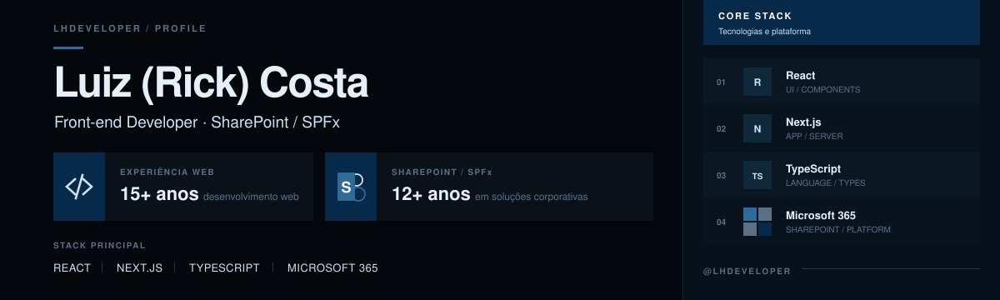

 

## Sobre mim

Sou **Luiz (Rick) Costa**, desenvolvedor front-end com **mais de 15 anos de experiência em desenvolvimento web** e **mais de 12 anos trabalhando com SharePoint**.

Minha trajetória combina **SharePoint e SPFx**, ecossistema Microsoft 365 e desenvolvimento front-end moderno com **React, Next.js e TypeScript**. Gosto de transformar necessidades complexas de negócio em interfaces claras, sustentáveis e fáceis de usar.

- **15+ anos** criando aplicações, interfaces e experiências para a web
- **12+ anos** desenvolvendo e evoluindo soluções baseadas em SharePoint
- Experiência com **SPFx, React, Next.js, TypeScript e Microsoft 365**
- Foco em interfaces bem resolvidas, arquitetura sustentável e produtos com propósito

## Experiência principal

<table>
  <tr>
    <td width="50%" valign="top">
      <h3>SharePoint & Microsoft 365</h3>
      
Desenvolvimento e evolução de soluções corporativas com SharePoint, SPFx e React, conectando necessidades de negócio a experiências mais claras e produtivas.

    </td>
    <td width="50%" valign="top">
      <h3>Desenvolvimento web</h3>
      
Mais de 15 anos construindo interfaces e aplicações web, combinando experiência prática, visão de produto e tecnologias modernas de front-end.

    </td>
  </tr>
</table>

## Projetos em destaque

<table>
  <tr>
    <td width="50%" valign="top">
      
      <h3>BootStick</h3>
      
Assistente interativo para criar mídias bootáveis do macOS e preparar a partição EFI para projetos OpenCore.

      
<a href="https://github.com/lhdeveloper/BootStick"><strong>Ver projeto →</strong></a>

    </td>
    <td width="50%" valign="top">
      
      <h3>EFI Manager</h3>
      
Painel em Next.js para diagnosticar, validar e gerenciar configurações OpenCore com mais segurança.

      
<a href="https://github.com/lhdeveloper/efi-admin"><strong>Ver projeto →</strong></a>

    </td>
  </tr>
</table>

## Tecnologias e ferramentas

---

  Construindo software com atenção aos detalhes — da interface ao resultado final.

